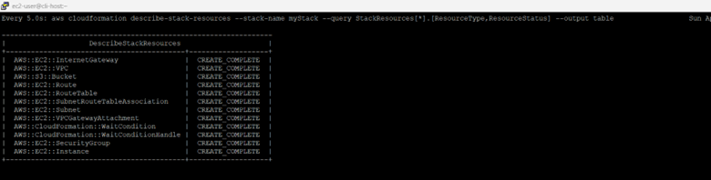
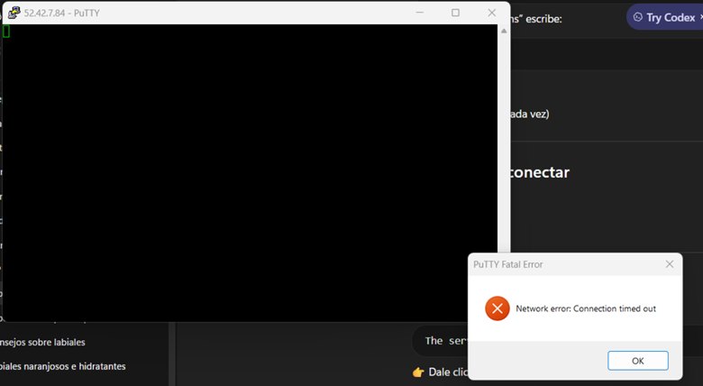
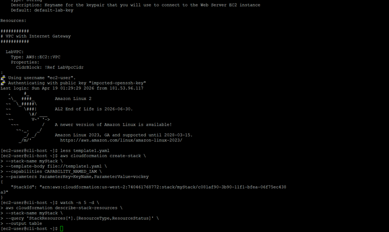
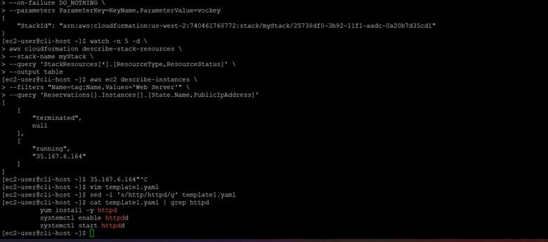
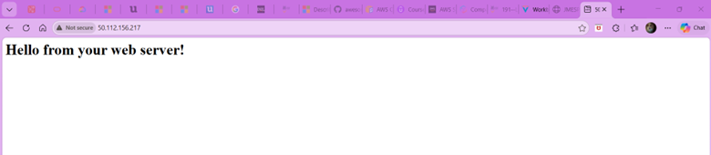

# 🚀 AWS CloudFormation IaC Web Server Deployment

## 📌 Overview

This project demonstrates how to deploy a web server on AWS using Infrastructure as Code (IaC) with AWS CloudFormation.

The deployment includes networking resources, an EC2 instance, and an automated Apache installation using user data scripts. Additionally, this project documents a real troubleshooting scenario during deployment.

---

## 🎯 Objective

- Automate infrastructure deployment using CloudFormation  
- Understand AWS networking fundamentals  
- Troubleshoot real-world cloud issues  
- Build a production-style Cloud/DevOps portfolio project  

---

## 🧠 Problem Statement

Manual AWS infrastructure setup is inefficient and error-prone.

This lab solves:

- ❌ Manual provisioning  
- ❌ Network misconfigurations  
- ❌ Deployment inconsistency  

Using:

- ✅ Infrastructure as Code  
- ✅ Automation  
- ✅ Reproducibility  

---

## 🏗️ Architecture Components

- Amazon VPC  
- Public Subnet  
- Internet Gateway  
- Route Table  
- Security Group  
- EC2 Instance  
- Apache Web Server (`httpd`)  

---

## ⚙️ Deployment Steps

### 1️⃣ Create the Stack

```bash
aws cloudformation create-stack \
--stack-name myStack \
--template-body file://template/template1.yaml \
--capabilities CAPABILITY_NAMED_IAM \
--parameters ParameterKey=KeyName,ParameterValue=vockey
```

This command launches all AWS resources defined in the template.

---

### 2️⃣ Monitor Stack Creation

```bash
watch -n 5 -d \
aws cloudformation describe-stack-resources \
--stack-name myStack \
--query 'StackResources[*].[ResourceType,ResourceStatus]' \
--output table
```

This allows real-time monitoring of resource creation.

📸 Evidence:  


---

### 3️⃣ Retrieve EC2 Public IP

```bash
aws ec2 describe-instances \
--filters "Name=tag:Name,Values=Web Server" \
--query 'Reservations[].Instances[].PublicIpAddress'
```

---

### 4️⃣ Access the Web Server

```
http://<PUBLIC-IP>
```

---

## ⚠️ Issue Encountered: SSH Timeout

📸 Evidence:  


At this stage, the SSH connection failed.

Possible causes:

- Instance not ready  
- Temporary lab/network issue  
- Security or routing delay  

---

## 🟢 SSH Connection Successful

📸 Evidence:  


After retrying, the connection succeeded.

Confirms:

- EC2 is reachable  
- SSH works correctly  

---

## ⚠️ Deployment Failure Investigation

To identify the issue:

```bash
sudo tail -50 /var/log/cloud-init-output.log
```

📸 Evidence:  


---

## 🔍 Root Cause Identified

```bash
yum install -y http
```

❌ Incorrect package name

This caused the web server installation to fail.

---

## 🛠️ Template Fix

📸 Evidence:  


Fix applied:

```
http → httpd
```

Correct commands:

```bash
yum install -y httpd
systemctl enable httpd
systemctl start httpd
```

---

## 🔄 Redeploy Infrastructure

```bash
aws cloudformation delete-stack --stack-name myStack
```

```bash
aws cloudformation create-stack \
--stack-name myStack \
--template-body file://template/template1.yaml \
--capabilities CAPABILITY_NAMED_IAM \
--on-failure DO_NOTHING \
--parameters ParameterKey=KeyName,ParameterValue=vockey
```

---

## ✅ Stack Creation Successful

📸 Evidence:  


All resources reached:

```
CREATE_COMPLETE
```

---

## 🌐 Final Validation

📸 Evidence:  


Output:

```
Hello from your web server!
```

Confirms:

- Apache running  
- HTTP access working  

---

## ❌ What Happens If It Fails?

Common issues:

- SSH timeout  
- CloudFormation rollback  
- Script errors  
- Package installation issues  

---

## 🛠️ Troubleshooting Approach

### 1. Check CloudFormation

```bash
aws cloudformation describe-stacks --stack-name myStack
```

### 2. Inspect Logs

```bash
sudo tail -50 /var/log/cloud-init-output.log
```

### 3. Validate Networking

- Security Groups (ports 22, 80)  
- Internet Gateway  
- Route Table  
- Public IP  

### 4. Fix and Redeploy

Repeat deployment after correcting errors.

---

## 🧩 Key Learning Outcomes

- Infrastructure as Code (IaC)  
- AWS networking fundamentals  
- Cloud troubleshooting  
- Log analysis  
- Deployment validation  

---

## 🌍 Real-World Relevance

This project reflects real DevOps work:

- Automating infrastructure  
- Debugging failures  
- Fixing configurations  
- Validating services  

---

## 💡 Engineering Perspective

A small mistake like:

```
http vs httpd
```

Can break an entire deployment.

This highlights:

- Importance of logs  
- Debugging skills  
- Attention to detail  

---

## 📁 Project Structure

```
aws-cloudformation-iac-webserver/
├── README.md
├── template/
│   └── template1.yaml
└── docs/
    └── screenshots/
```

---

## 👩‍💻 Author

Bárbara Catalina Gómez Pérez

---

## ⭐ Final Thoughts

This project demonstrates real-world cloud engineering skills, including deployment, troubleshooting, and validation using Infrastructure as Code.
