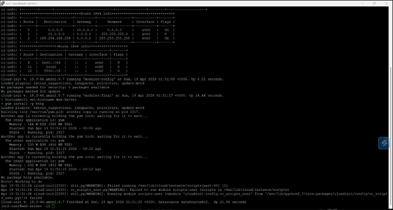

# 🚀 AWS CloudFormation Infrastructure as Code (IaC) Web Server Deployment with Troubleshooting


---

## 📌 Overview

This project demonstrates how to deploy a web server on AWS using **Infrastructure as Code (IaC)** with AWS CloudFormation.

It includes:

- Automated infrastructure provisioning  
- AWS networking configuration (VPC, Subnet, IGW)  
- EC2 deployment with Apache (`httpd`)  
- Real-world troubleshooting using cloud-init logs  

---

## 🎯 Objective

- Automate infrastructure deployment using CloudFormation  
- Understand AWS networking fundamentals  
- Troubleshoot real-world cloud issues  
- Build a production-style Cloud/DevOps portfolio project  

---

## 🧠 Problem Statement

Manual AWS infrastructure setup is inefficient and error-prone.

This project solves:

- ❌ Manual provisioning  
- ❌ Network misconfigurations  
- ❌ Deployment inconsistency  

Using:

- ✅ Infrastructure as Code  
- ✅ Automation  
- ✅ Reproducibility  

---

## 🏗️ Architecture Diagram


> Public subnet with direct internet access through Internet Gateway, enabling HTTP traffic to EC2 instance.

---

## 🧱 Architecture Components

- Amazon VPC  
- Public Subnet  
- Internet Gateway  
- Route Table  
- Security Group  
- EC2 Instance  
- Apache Web Server (`httpd`)  

---

## ⚙️ Deployment Steps

### 1️⃣ Create the Stack

```bash
aws cloudformation create-stack \
--stack-name myStack \
--template-body file://template/template1.yaml \
--capabilities CAPABILITY_NAMED_IAM \
--parameters ParameterKey=KeyName,ParameterValue=vockey
```

---

### 2️⃣ Monitor Stack Creation

```bash
watch -n 5 -d \
aws cloudformation describe-stack-resources \
--stack-name myStack \
--query 'StackResources[*].[ResourceType,ResourceStatus]' \
--output table
```


> Real-time monitoring of CloudFormation resource creation.

---

### 3️⃣ Retrieve EC2 Public IP

```bash
aws ec2 describe-instances \
--filters "Name=tag:Name,Values=Web Server" \
--query 'Reservations[].Instances[].PublicIpAddress'
```

---

### 4️⃣ Access the Web Server

```
http://<PUBLIC-IP>
```

---

## ⚠️ Issue Encountered: SSH Timeout


> Initial SSH connection failed due to instance readiness/network timing.

---

## 🟢 SSH Connection Successful


> Connection succeeded after retry, confirming EC2 accessibility.

---

## ⚠️ Deployment Failure Investigation

```bash
sudo tail -50 /var/log/cloud-init-output.log
```



> Cloud-init logs used to identify installation failure.

---

## 🔍 Root Cause Identified

```bash
yum install -y http
```

❌ Incorrect package name

---

## 🛠️ Template Fix


Fix applied:

```
http → httpd
```

```bash
yum install -y httpd
systemctl enable httpd
systemctl start httpd
```

---

## 🔄 Redeploy Infrastructure

```bash
aws cloudformation delete-stack --stack-name myStack
```

```bash
aws cloudformation create-stack \
--stack-name myStack \
--template-body file://template/template1.yaml \
--capabilities CAPABILITY_NAMED_IAM \
--on-failure DO_NOTHING \
--parameters ParameterKey=KeyName,ParameterValue=vockey
```

---

## ✅ Stack Creation Successful


> All resources reached CREATE_COMPLETE status.

---

## 🌐 Final Validation


```
Hello from your web server!
```

> Apache successfully running and accessible via HTTP.

---

## ❌ What Happens If It Fails?

Common issues:

- SSH timeout  
- CloudFormation rollback  
- User data script errors  
- Package installation issues  

---

## 🛠️ Troubleshooting Approach

### 1. Check CloudFormation

```bash
aws cloudformation describe-stacks --stack-name myStack
```

### 2. Inspect Logs

```bash
sudo tail -50 /var/log/cloud-init-output.log
```

### 3. Validate Networking

- Security Groups (ports 22, 80)  
- Internet Gateway  
- Route Table  
- Public IP  

### 4. Fix and Redeploy

---

## 🧩 Key Learning Outcomes

- Infrastructure as Code (IaC)  
- AWS networking fundamentals  
- Cloud troubleshooting  
- Log analysis  
- Deployment validation  

---

## 🌍 Real-World Relevance

This project reflects real DevOps work:

- Automating infrastructure  
- Debugging failures  
- Fixing configurations  
- Validating services  

---

## 💡 Engineering Perspective

A small mistake like:

```
http vs httpd
```

Can break an entire deployment.

---


## 📁 Project Structure

```
aws-cloudformation-iac-webserver/
├── README.md
├── template/
│   └── template1.yaml
└── docs/
    └── screenshots/
```

---

## 👩‍💻 Author

Bárbara Catalina Gómez Pérez

---

## ⭐ Final Thoughts

This project demonstrates real-world cloud engineering skills, including deployment, troubleshooting, and validation using Infrastructure as Code.
